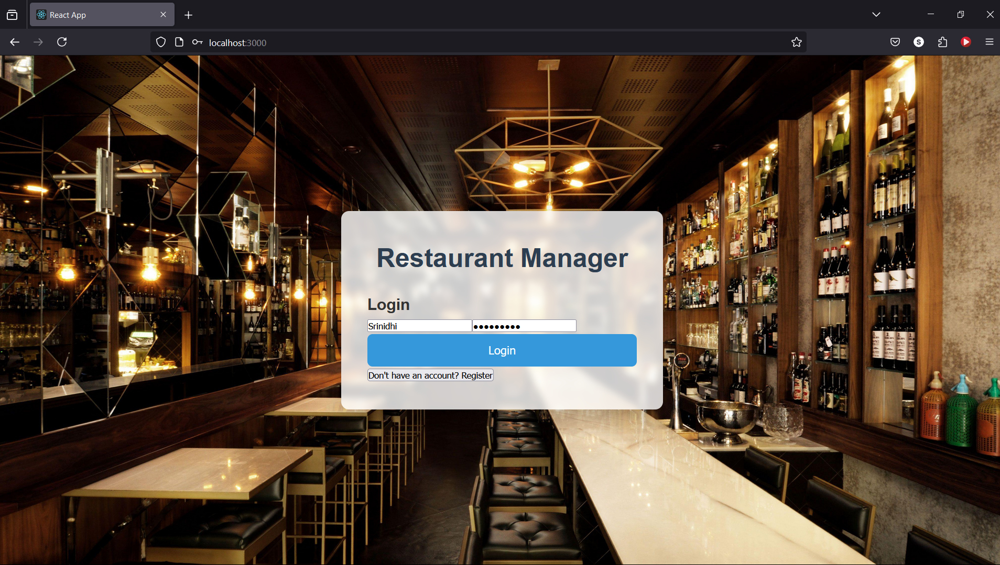
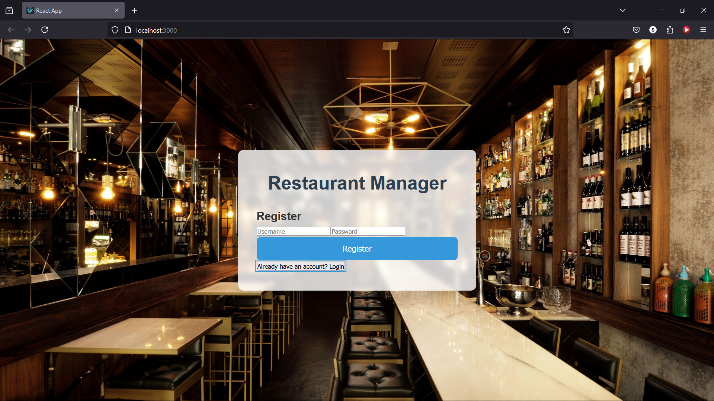
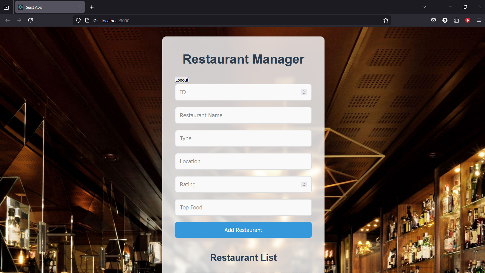
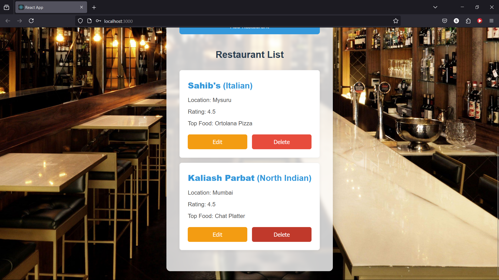
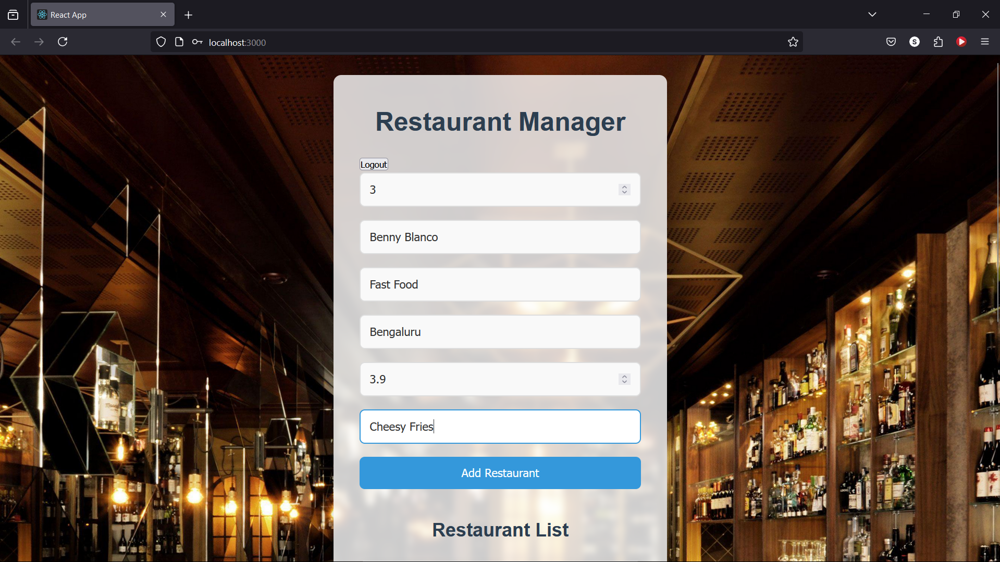
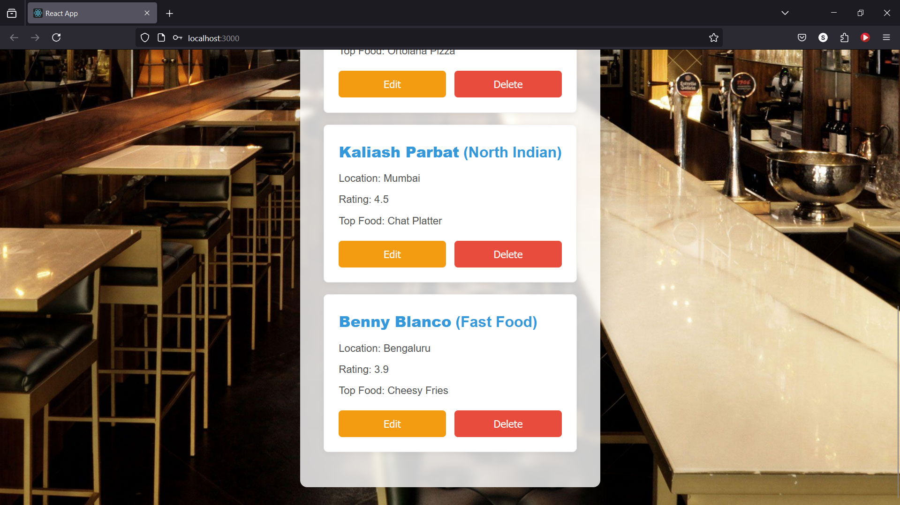
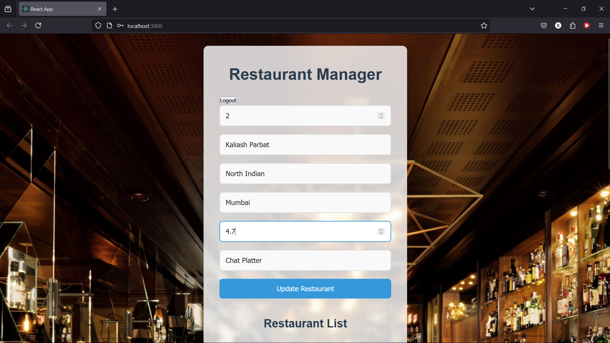
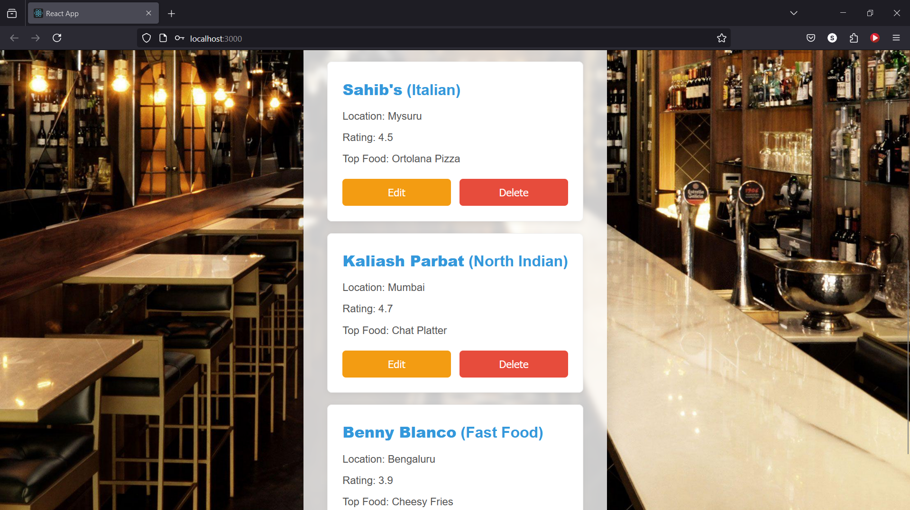
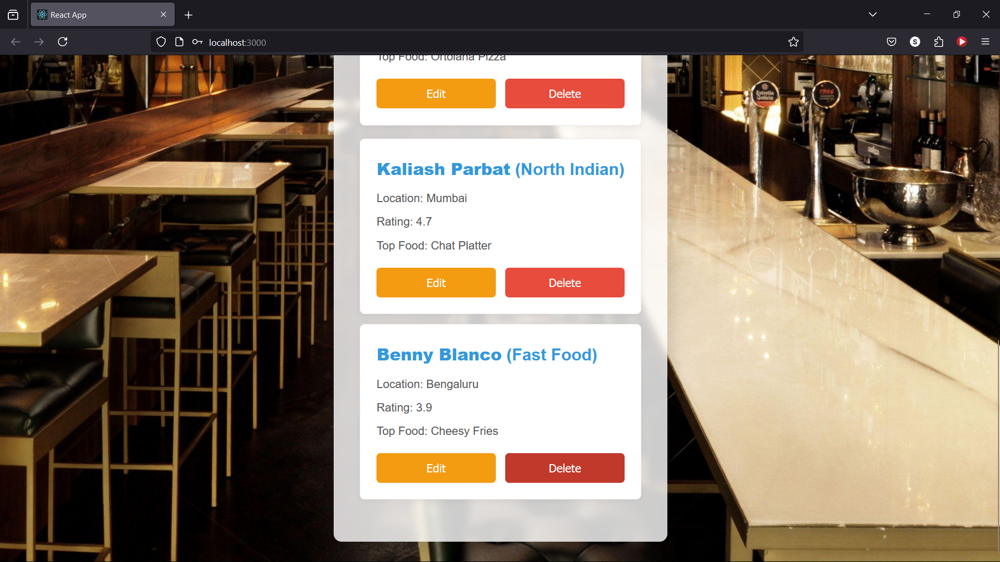
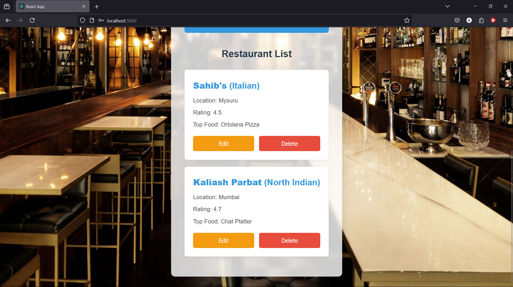

# Restaurant Manager App

A simple **Restaurant Management System** built with **MERN stack** (MongoDB, Express.js, React, Node.js). This application allows users to manage a list of restaurants, with features for adding, updating, and deleting restaurants. It also includes a user authentication system with JWT tokens to protect sensitive operations.

## Features

- **User Registration & Login**: Secure user registration and login using JWT authentication.
- **Restaurant Management**: Add, update, delete, and view restaurant data.
- **Protected Routes**: Secure access to restaurant management features with JWT token-based authentication.
- **Responsive UI**: The front-end is built with React and styled with custom CSS, making it responsive on both desktop and mobile devices.

## Tech Stack

- **Frontend**: React.js
- **Backend**: Node.js with Express.js
- **Database**: MongoDB
- **Authentication**: JWT (JSON Web Token)
- **Password Hashing**: bcryptjs

### Prerequisites

1. **Node.js**: Ensure Node.js is installed on your machine. You can download it from [here](https://nodejs.org/).
2. **MongoDB**: Install MongoDB locally or use a cloud database like MongoDB Atlas.

## API Endpoints

- **POST /register**: Register a new user (expects `username` and `password` in the body).
- **POST /login**: Login an existing user (expects `username` and `password` in the body).
    - Returns a JWT token upon successful login.
- **GET /restaurants**: Get the list of restaurants (requires JWT token in the `Authorization` header).
- **POST /insertRestaurants**: Insert a new restaurant (requires JWT token in the `Authorization` header).
    - Expects restaurant data (`id`, `name`, `type`, `location`, `rating`, `top_food`).
- **PUT /updateRestaurant/:id**: Update a restaurant (requires JWT token in the `Authorization` header).
    - Expects updated restaurant data in the body.
- **DELETE /deleteRestaurant/:id**: Delete a restaurant by ID (requires JWT token in the `Authorization` header).

## Usage

- **Login / Register**: Users must first register an account and then log in to access protected routes.
- **Manage Restaurants**: Once logged in, users can add, update, or delete restaurants from the database. A list of restaurants will be displayed once logged in.

# Restaurant Management System

## Screenshots

### Login / Register
- **Login Page**  
  The login page allows users to authenticate and access the restaurant management system. Users can enter their credentials to gain access.  
  

- **Register Page**  
  The register page enables new users to create an account by entering their details. This step is necessary for accessing the system if you don't already have an account.  
  

### Restaurant Management

- **General Restaurant Management UI**  
  This is the main interface for managing restaurants within the system. It provides options to add, update, and delete restaurants, as well as view the list of existing restaurants.  
  

- **Listing All Restaurants**  
  This screen displays a list of all the restaurants managed within the system. Each restaurant is shown with basic details such as name, location, and status.  
  

### Inserting a Restaurant

- **Adding Restaurant Information (Step 1)**  
  In this screen, users can enter the initial details of a new restaurant, including name, location, and type of cuisine.  
  

- **Adding Restaurant Information (Step 2)**  
  We can see that the restaurant is added to our list.  
  

### Updating Restaurant Info

- **Updating Restaurant Information (Step 1)**  
  This UI allows users to edit the information of an existing restaurant, such as updating the name, location, or rating.  
  

- **Updating Restaurant Information (Step 2)**  
  We can see that the information about the restaurant is updated.  
  

### Deleting a Restaurant

- **Deleting a Restaurant (Step 1)**  
  This screen is used to initiate the deletion of a restaurant. Users can select a restaurant to remove from the system.  
  

- **Deleting a Restaurant (Step 2)**  
  We can see that the restaurant has been removed from our list.  
  
